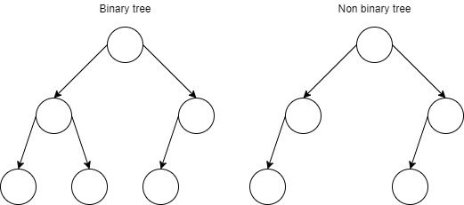

# Heap (Binary heap)
Existen dos versiones de esta estructura de datos, el **max heap** y el **min heap**.
Esta estructura de datos trata de representar un arbol binario haciendo uso de un array, lo cual permite que 
esta estructura se beneficie de esto.

Recordemos que un arbol binario tiene caracteristicas importantes que lo definen:   
1. Todos los niveles estan completos, salv tal vez el ultimo nivel.
2. Todo nodo tiene a lo mucho, dos hijos. Salvo tal vez el ultimo hijo en el ultimo nivel del arbol.

   

Dada la estructura del binary tree, representarlo en un array resulta conveniente  

   

## Binary max heap
El max heap posee la propiedad de que cualquier nodo posee un valor mayor o igual al de sus nodos hijos. Es decir,
si leyeramos el arbol de abajo hacia arriba pareceria que este se encuentra ordenado de mejor a mayor. estando los 
valores menores al fondo del arbol y los valores mayores mas cerca de la raiz.

## Binary min heap
El min heap es la version inversa del max heap, donde los valores mas grandes estan mas cerca del fondo del arbol, mientras
que aquellos valores menores estan mas cerca de la raiz.