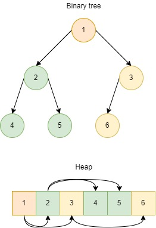

# Heap (Binary heap)
Existen dos versiones de esta estructura de datos, el **max heap** y el **min heap**.
Esta estructura de datos trata de representar un arbol binario haciendo uso de un array, lo cual permite que 
esta estructura se beneficie de esto.

Recordemos que un arbol binario tiene caracteristicas importantes que lo definen:   
1. Todos los niveles estan completos, salv tal vez el ultimo nivel.
2. Todo nodo tiene a lo mucho, dos hijos. Salvo tal vez el ultimo hijo en el ultimo nivel del arbol.

Dada la estructura del binary tree, representarlo en un array resulta conveniente
